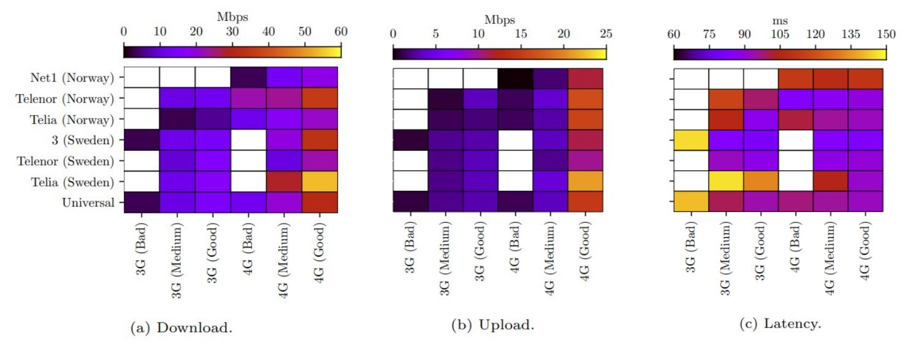

ERRANT: EmulatoR of Radio Access NeTworks
=========================================

ERRANT is an advanced emulator of radio access networks, tuned thank to a large-scale measurement campaign on operational mobile networks.

It uses `tc-netem` to install traffic shaping policies, allowing the user to choose between 32 profiles that differ for emulated operator, RAT (3g or 4g) and signal quality. The exact parameters of the shaping policies are dynamic, in the sense that they may vary at each run based on the values observed on the real network. 
The available profiles are saved in the `model.pickle` file. ERRANT can also vary parameters dynamically (every `n` seconds) to emulate variable networks, and simulate moving scenario using the `ApplyScenario` script. 

An overview of the available profiles is depicted below:



## Prerequisites

This tool runs on Linux, and builds on top of the `tc-netem` tool.
It also uses the `ifb` kernel module to shape incoming traffic.

You need also Python3 with updated versions of `pandas==0.24.2` and `scipy`.

ERRANT is able to emulate profiles available in the `profiles.csv` file, that describes their average values for latency, upload and download bandwidth. Check it to have the complete list, or see the image above.

## Usage

You need to execute it as `root`.

Usage ERRANT for emulation without a scenario:
```
errant -o operator -c country -t technology -q quality -i interface [-p period] [-l logfile] [-r] [-d] [-h]
```

Parameters are:
* `operator`: the Mobile Network Operator to emulate.
* `country`: the country network to emulate.
* `technology`: whether to emulate 3g or 4g.
* `quality`: signal quality to emulate: bad, medium or good.
* `interface`: the name of the interface where to apply shaping.
* `period`: change network conditions periodically after `period` seconds.
* `logfile`: write on a `logfile` the employed values. Useful with `-p` option.
* `-r`: stop doing traffic shaping. Remove all the shaping policies.
* `-d`: dry run (only print all commands that would execute).
* `-h`: print help.

Note that to use the operator-agnostic models, you must specify `universal` for operator and country.

Usage ERRANT for emulation with a scenario:
```
ApplyScenario.py -s scenario.csv -i interface
```
Parameters are:
* `scenario.csv`: the name of the csv file containing the list of profiles to be emulated.
* `interface`: the name of the interface where to apply shaping.

The `scenario.csv` is a csv file where each row describes:
* `operator`: the Mobile Network Operator to emulate.
* `country`: the country network to emulate.
* `technology`: whether to emulate 3g or 4g.
* `quality`: signal quality to emulate: bad, medium or good.
* `duration`: move to the next network profile after `duration` seconds.
* `period`: change network conditions periodically after `period` seconds.

## Log File

If the `-l LOGFILE` is set, ERRANT writes on `LOGFILE` a CSV log reporting the sampled values.
It is useful to understand what was going on when analyzing the experimental results.
The output file is in CSV format, and has the form:

```
time,operator,country,technology,quality,download,upload,rtt
1601642003,telenor,norway,4g,good,17580.07864961684,14188.136689046294,82.01200449624072
1601642006,telenor,norway,4g,good,22459.411614246997,16390.649528907834,64.16737469308717
1601642009,telenor,norway,4g,good,16158.579500704867,20363.285880299878,99.9752608514997
1601642012,telenor,norway,4g,good,22858.805018745887,9214.935379313456,129.7896828007226

```

## Running a trace from file

You can use our convenience script `trace_run` to run a trace-based emulation, in which different models can be applied as time passes. The syntax of the command is:

```
trace_run [-h] [-f SCENARIO_FILE] -i INTERFACE [-d] [-n]

Arguments:
  -h, --help        show this help message and exit
  -f SCENARIO_FILE  File with the trace to run
  -i INTERFACE      Destination interface
  -d                Make a dry run
  -n                Leave last shaping policy on, when ending
```

The scenario file must be in `csv` format and contain for each line the specific of the model to apply (operator, country, rat and quality). It must also contain how long to keep the model on (`duration`). It can finally contain an eventual `period` to change network conditions periodically. Leave it blank or `-` to avoid doing this. See the file `trace_example.csv` for an example.


## Examples

Run simulation with Norway Telenor 4G Good profile. Impose the profile to eth0 interface:
```
errant -o telenor -c norway -t 4g -q good -i eth0 
```

Run simulation with universal 4G Good profile. Impose the profile to eth0 interface:
```
errant -o universal -c universal -t 4g -q good -i eth0 
```

Run simulation with Norway Telenor 4G Good profile and periodically change network condition every 10s. Impose the profile to eth0 interface:
```
errant -o telenor -c norway -t 4g -q good -p 10 -i eth0 
```

Usage ERRANT for emulation with a scenario:
```
ApplyScenario.py -s scenario.csv -i eth0
```

## Limitations

Due to the use of the `ifb` kernel module, you can impose shaping to one interface at a time.

We still do not have profile describing 5G networks. We are working for running experiments and create some profiles.

## Creation of new models

If you want to create new models based on other measurements, you can use the scripts provided in the `model_creation` directory, where we provide the code and instructions to generate a new model file compatible with ERRANT.
